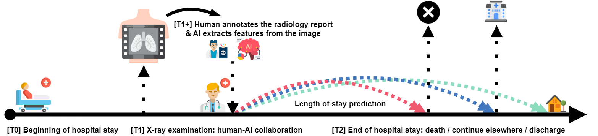

# xlungs-trustworthy-los-prediction

Part of the [xLUNGS](https://xlungs.mi2.ai) project. This directory contains code and the **TLOS** dataset associated with the article

> H. Baniecki, B. Sobieski, P. Bombiński, P. Szatkowski, P. Biecek. *Hospital Length of Stay Prediction Based on Multi-modal Data towards Trustworthy Human-AI Collaboration in Radiomics*. **In review**, 2023.

```
 @misc{tlos,
    title = {{Hospital Length of Stay Prediction Based on Multi-modal Data 
              towards Trustworthy Human-AI Collaboration in Radiomics}},
    author = {Hubert Baniecki and Bartlomiej Sobieski and Przemysław Bombiński 
              and Patryk Szatkowski and Przemysław Biecek},
    note = {In review},
    year = {2023}
}
```



## Data

The preprocessed **TLOS** dataset in the tabular form is available in [data](/data). Raw X-ray data including images and radiology reports cannot be openly shared due to privacy concerns. For inquires please write at [xlungs@pw.edu.pl](mailto:xlungs@pw.edu.pl).

## Directories

- `code` made available under the [MIT license](code/LICENSE)
- `data` made available under the [CC-BY-NC-ND-4.0 license](data/LICENSE)
- `results`

## Dependencies

The analysis was performed using the following software:
- R v4.2.1 
    - `survex` v0.2.2 updated at https://github.com/ModelOriented/survex/tree/xlungs-trustworthy-los-prediction
    - `mlr3proba` v0.4.17 accessed from https://github.com/mlr-org/mlr3proba
    - `mboost` v2.9.7 updated with the following fix https://github.com/boost-R/mboost/pull/118
- Python v3.8.13
    - `pyradiomics` v3.0.1
    - `pydicom` v2.3.0

## Acknowledgements

This work was financially supported by the NCBiR grant number `INFOSTRATEG-I/0022/2021-00`, and carried out with the support of the Laboratory of Bioinformatics and Computational Genomics and the High Performance Computing Center of the Faculty of Mathematics and Information Science, Warsaw University of Technology.